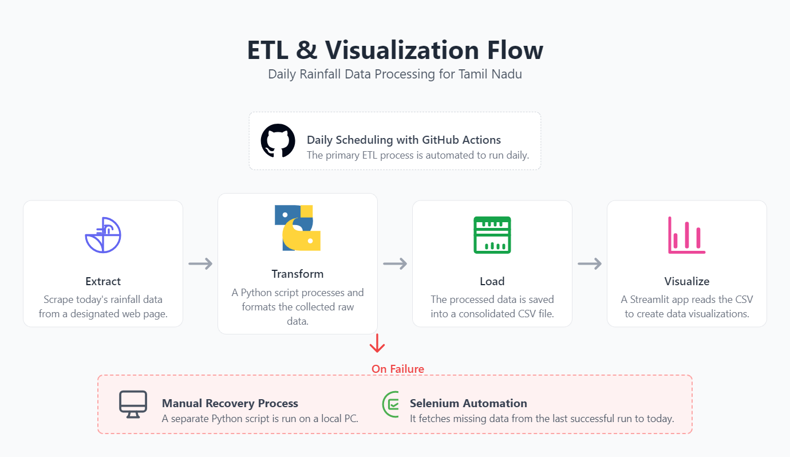
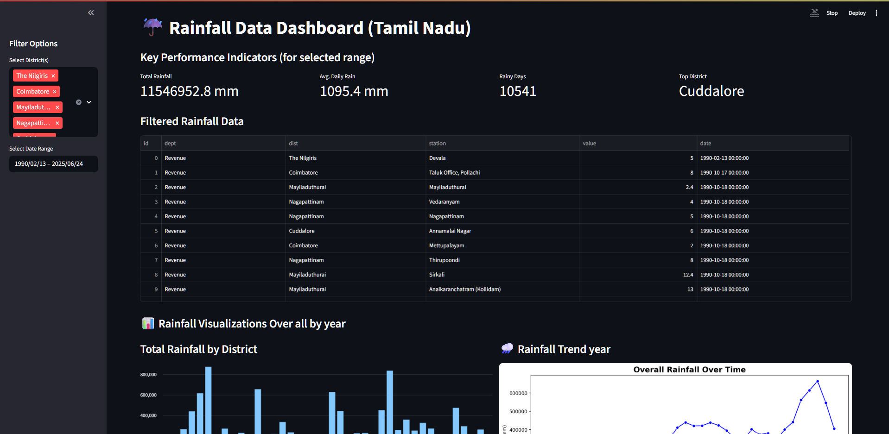

This project contains a Python script to automate the process of downloading or scraping rainfall data for various districts in Tamil Nadu.
# Tamil Nadu Rainfall Data Automation & Visualization

This project contains Python scripts to automate the scraping, storage, and visualization of daily rainfall data for various districts in Tamil Nadu.

## Description

This project uses Selenium for web automation to navigate to a data source (e.g., a government website) and extract daily or monthly rainfall data. The primary goal is to automate a manual and repetitive task, making it easier and faster to collect this data for analysis or record-keeping.
This project uses `requests` and `BeautifulSoup` for efficient daily scraping and `Selenium` for historical data backfilling from the TNSMART website. The collected data is stored in `tnRainfallData.csv` and can be explored through an interactive Streamlit web application.

### Key Files
*   `main.py`: A lightweight script to fetch **only the current day's** rainfall data. It's designed for frequent, automated runs (e.g., via GitHub Actions).
*   `getData.py`: A more robust script using Selenium to fetch data for a range of dates, starting from the last recorded date in the CSV up to the present. This is useful for the initial data collection or for filling in any gaps if the daily automation fails.
*   `app.py`: A Streamlit dashboard to visualize the collected rainfall data with filters, KPIs, and various charts.
*   `tnRainfallData.csv`: The database where all collected rainfall data is stored.

## Prerequisites

Before you begin, ensure you have the following installed:
*   Python 3.8+
*   A modern web browser like Google Chrome or Mozilla Firefox.
*   The corresponding WebDriver for your browser. Make sure it's in your system's `PATH`.
*   The corresponding WebDriver for your browser (e.g., ChromeDriver for Chrome). Make sure it's accessible in your system's `PATH`.

## Installation

1.  **Clone the repository (if it's on Git):**
1.  **Clone the repository:**
    ```bash
    git clone https://github.com/arun8nov/TN_RainfallData_Automation
    cd TN_RainfallData_Automation
    ```

2.  **Create and activate a virtual environment:**

    *On Windows:*
    *   **On Windows:**
    ```bash
    python -m venv .venv
    .\.venv\Scripts\activate
    ```

    *On macOS/Linux:*
    *   **On macOS/Linux:**
    ```bash
    python3 -m venv .venv
    source .venv/bin/activate
    ```

3.  **Install the required packages:**
    If you have a `requirements.txt` file, run:
    ```bash
    pip install -r requirements.txt
    ```

## Usage
## Usage Instructions

To run the automation script, execute the main Python file from your terminal. Make sure your virtual environment is activated first.
```bash
python main.py
```
Follow these steps to run the project.

### Step 1: Fetch the Rainfall Data

You have two options for fetching data. Choose one based on your needs.

**Option A: Daily Automated Update (Fast)**

This is the recommended method for daily updates. The `main.py` script quickly checks for and adds only the latest data. It is ideal for running via an automated scheduler like GitHub Actions.

```bash
python main.py
```

**Option B: Manual Backfill / Initial Run (Slower)**

Use this script if you are running the project for the first time or if the daily automation has failed for several days. It uses Selenium to open a browser and fetch all missing data from the last recorded date to today.

```bash
python getData.py
```
> **Note:** This will open a browser window and may take some time to complete, depending on the number of days it needs to backfill.

### Step 2: Visualize the Data

After you have populated `tnRainfallData.csv` using one of the methods above, you can view the interactive dashboard.

1.  Make sure your virtual environment is still activated.

2.  Run the following command in your terminal:
    ```bash
    streamlit run app.py
    ```

3.  Your default web browser will open a new tab with the dashboard. You can now filter by district and date range to explore the rainfall data.

## ETL Diagram



## 🖼️ Dashboard Screenshot



## Author

*   **Arunprakash B**
